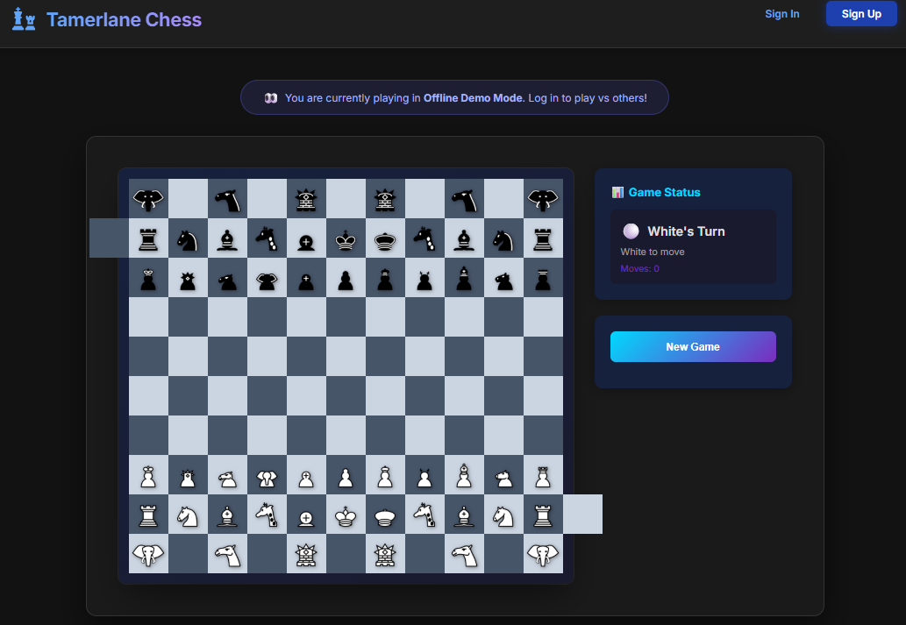
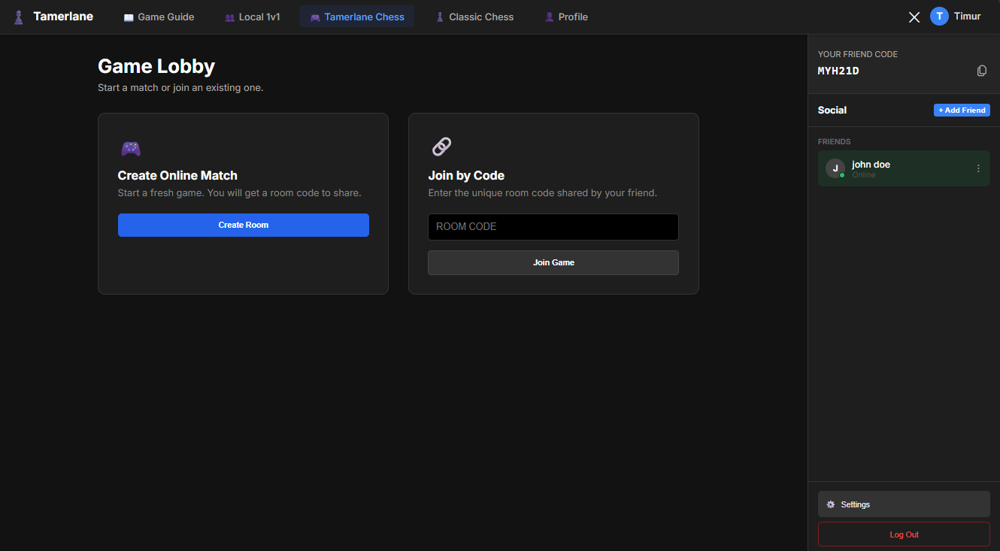
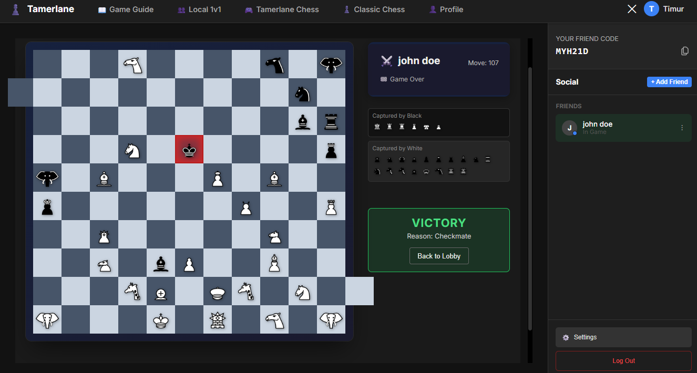
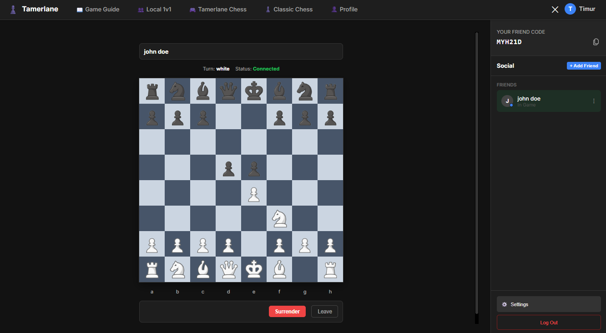
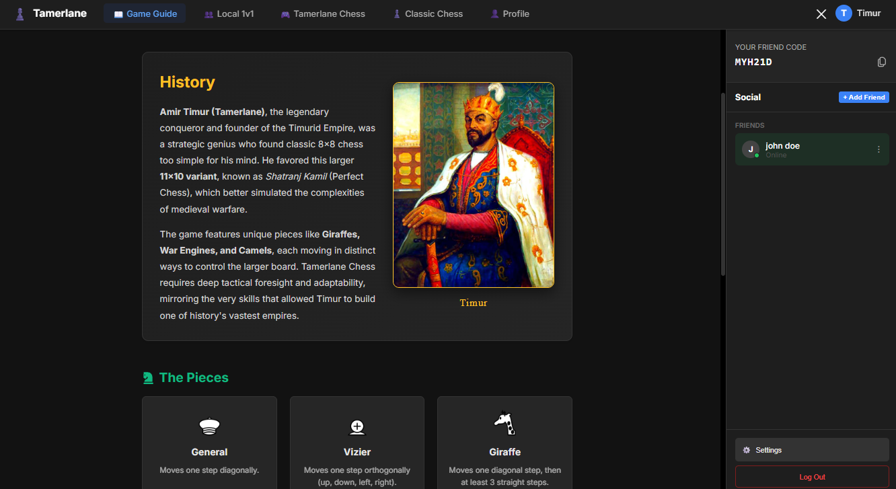
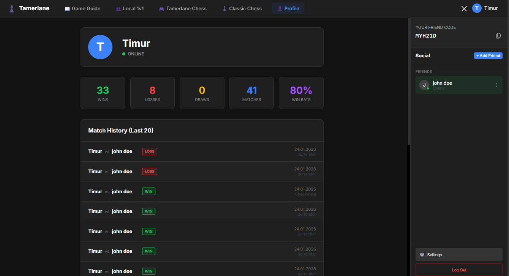

# Tamerlane Chess Platform


**Tamerlane Chess Platform** is a comprehensive, full-stack web application that brings the legendary **Tamerlane Chess (Timur Satrancı)** to life in the digital age. This historic 11×10 chess variant, once favored by the great conqueror Amir Timur himself, combines authentic medieval gameplay with modern multiplayer technology.

Experience the strategic depth that challenged one of history's greatest military minds, now enhanced with real-time online play, interactive tutorials, and a vibrant community of strategy enthusiasts.

## 🛠️ Technology Stack


## ✨ Features

- **Authentic Gameplay**: Complete implementation of Tamerlane Chess rules, including the complex "Bent Rider" movement for Giraffes.
- **Classic Chess Support**: Fully functional standard 8x8 Chess for traditional play.
- **Online Multiplayer**: Real-time lobby system to create and join rooms using Room Codes.
- **Authentication**: Secure Sign Up/Sign In system with email verification.
- **Modern UI/UX**: Dark/Slate aesthetic reflecting the "Iron Emir" theme.

## 🎮 Platform Features

### Authentication & Multiplayer Lobby

| Main Page | Game Lobby |
|:---:|:---:|
|  |  |

**Secure Authentication System**
- Email-based registration with verification
- Modern, sleek dark-themed UI
- Password recovery and account management
- Persistent sessions for seamless gameplay

**Real-Time Multiplayer Lobby**
- Create private rooms with unique room codes
- Join public matches or invite friends
- Live player status indicators (Online/In-Game/Offline)
- Instant match notifications and invitations

---

### Dual Game Modes

| Tamerlane Chess (11x10) | Classic Chess (8x8) |
|:---:|:---:|
|  |  |

**Tamerlane Chess Mode**
- Experience historical 14th-century warfare
- Large board strategy with Citadels
- 112 squares of complex tactical maneuvers

**Classic Chess Mode**
- Traditional 8x8 Standard Chess
- Complete rules including En Passant and Castling
- Perfect for quick warm-up games before the main event

### Learning & Player Progression

| Game Guide | Profile |
|:---:|:---:|
|  |  |

**Interactive Game Guide**
- Complete visual guide to all 10+ unique piece types
- Detailed movement patterns and special rules
- Historical context about Amir Timur and the game's origins
- Strategic tips for mastering the 11x10 board

**Comprehensive Player Profiles**
- Track wins, losses, draws, and win rate statistics
- View last 20 match history with detailed results
- Player status system (Online/Playing/Offline)
- Friend system with real-time status updates

---

## ♟️ About Tamerlane Chess

**Tamerlane Chess** (also known as *Shatranj Kamil* or "Perfect Chess") is a historic chess variant played on an 11×10 board with two additional **Citadel** squares. This game was favored by **Amir Timur (Tamerlane)**, the legendary 14th-century conqueror who found standard 8×8 chess too simplistic for his strategic mind.

### What Makes It Unique?

- **Larger Battlefield**: 11×10 board + 2 Citadels = 112 playable squares
- **Exotic Pieces**: Giraffes, War Engines, Camels, and Elephants with unique movement patterns
- **Complex Strategy**: The "Bent Rider" Giraffe movement and piece-specific pawn promotions
- **Historical Authenticity**: Based on medieval Persian manuscripts and historical records
- **Bare King Rule**: Win by checkmate OR by capturing all opponent's pieces except the King

## 🚀 Getting Started

1.  **Clone the repository**
    ```bash
    git clone https://github.com/yourusername/tamerlane-chess-platform.git
    cd tamerlane-chess-platform
    ```

2.  **Install Dependencies**
    ```bash
    npm install
    ```

3.  **Run Development Server**
    ```bash
    npm run dev
    ```

## 📜 Rules of Tamerlane Chess

- **Board**: 11x10 squares + 2 Citadels.
- **Giraffe**: Moves 1 diagonal, then slides straight (min 3 squares).
- **Elephant**: Moves exactly 2 squares diagonally.
- **Camel**: Moves 1 diagonal + 2 straight.
- **War Engine**: Moves 2 squares orthogonally.

